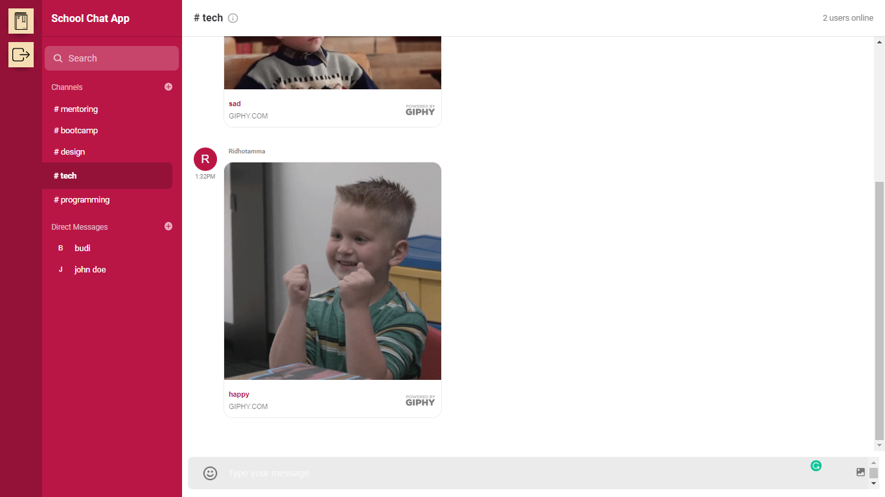

# School chat application

## Dashboard

## Sign Up Form

## technologies that I used

- React JS
- Node JS
- Express JS
- Pure CSS
- Getstream api

Setup:

- run `npm i && npm start` for both client and server side to start the development server
